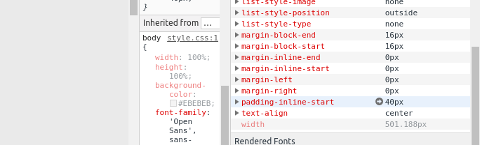

# starting-web-developpment

Réaliser une page de présentation de Tim Berner Lee

### Objectifs d'apprentissage

  
  - Comprendre les principes du HTML et du CSS
  - Respecter des consignes
  
  
### Etapes de l'exercice

Nous devions, sur base de la photo d'un site, reproduire le même.

Voici la référence que nous avons reçue :

### Difficultés

La difficulté rencontrée sur cet exercice était de comprendre pourquoi les icones dans la div centrale ne se centrait pas.

Il apparait que les icones installées depuis fontawesome.com
arrivent avec un padding-inline-start de 40px.

### Auteur

Github page : https://godfroidemmanuel.github.io/starting-web-developpment/

Godfroid Emmanuel

Apprenant chez BeCode depuis le 16 avril 2019.